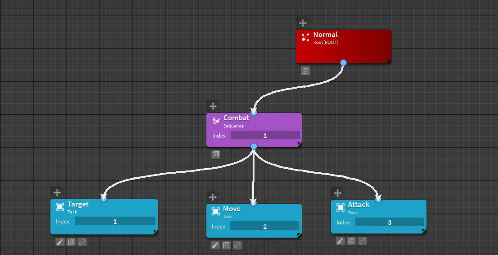

# HellSpire

Project HellSpire is a zombie game that uses behavior trees for advanced AI.

Below is an example behavior-tree illustration used by the game:



## Code examples

The Target class locates the player by comparing the distance between the current rig (retrieved from the blackboard) and every player. Once the closest player is identified, it sets that player as the target and stores the result in the blackboard.
```lua
local Task = {}

local SUCCESS, FAIL = 1, 2

function Task.start(obj)
	
end

function Task.run(obj)
	local Blackboard = obj.Blackboard
	local rig = Blackboard.Rig
	if not (rig and rig:FindFirstChild("HumanoidRootPart")) then
		return FAIL
	end
	
	if Blackboard.Attacking then return SUCCESS end


	local closest, shortest = nil, math.huge
	for _, plr in pairs(workspace.Map.Players:GetChildren()) do
		local hrp = plr:FindFirstChild("HumanoidRootPart")
		if hrp then
			local dist = (rig.HumanoidRootPart.Position - hrp.Position).Magnitude
			if dist < shortest then
				shortest, closest = dist, plr
			end
		end
	end

	if closest then
		Blackboard.Target = closest
		warn("Calculation")
		return SUCCESS
	end

	return SUCCESS
end

return Task

```

I prefer to keep the code clean and compact, while also exporting types with Roblox modules for the AI class.